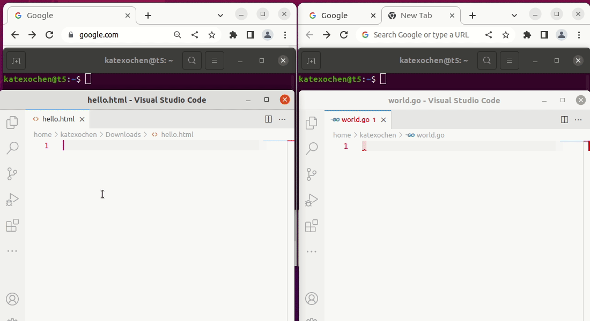

# Secondseat - Have fun together on the same host

Secondseat lets you add a second keyboard and mouse to a new primary XInput, so you can use
two dedicated pointers and type parallel in different windows at the same time. It is a small
wrapper around the `xinput` CLI.



## Prerequisites

- Minimal XServer version 1.20
- XInput must be installed
- Go installed

## Install

```bash
go install github.com/katexochen/secondseat@latest
```

## Usage

```text
  secondseat [command]

Available Commands:
  add         Add input devices for a second user
  remove      Remove second input user
  help        Help about any command
  completion  Generate the autocompletion script for the specified shell

Flags:
  -h, --help   help for secondseat

Use "secondseat [command] --help" for more information about a command.
```

## Limitations

- Curser flickering when moving the one of the pointers.
- Sometimes the selection of windows doesn't work as expected.
- Some applications don't support multiple pointers and won't differentiate between the different input devices. Applies to:
  - Firefox (Chromium works)

## Further information

- [ArchWiki: Multi-pointer X](https://wiki.archlinux.org/title/Multi-pointer_X)
